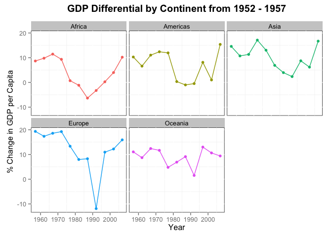

# Applied Quantitative Methods - Workshop Series
___


___

### <span style="color:#0066CC">Welcome to your official AQM homepage!<span>
(_redirect back to [homepage](http://dustin21.github.io/)_)


Here you will be able to find the workshop resources, including:

* Weekly projects
* Reading assignments
* Slides
* Important links

Please save this page in your bookmarks, as you will be returning to it quite often.

Email: [aqmworkshop@gmail.com](aqmworkshop@gmail.com)

Let the fun begin!

***


### Week #1 - The Awakening

**Part 1** - 
Please download the in-class [activity sheet](https://github.com/Dustin21/Dustin21.github.io/blob/master/AQM/activity_sheet.pdf?raw=true).

**Part 2** - 
Follow along with these [slides](Slides/slides01_Intro.html).

Get your software set up:

1. [Install R](http://cran.stat.sfu.ca/)
2. [Install RStudio](http://www.rstudio.com/products/rstudio/download/)
3. [Install Git](http://git-scm.com/)
4. [Set-up Github account](https://github.com/)
5. [Get free student account](https://education.github.com/)
6. [Connect R Studio with Github](http://www.r-bloggers.com/rstudio-pushing-to-github-with-ssh-authentication/), or try [here](http://www.molecularecologist.com/2013/11/using-github-with-r-and-rstudio/)
7. Become familiar with **commit**, **pull**, **push** routine.
8. Upload your first `README.md` to your new repository!

#### Assignment 1 - The Markdown Challenge

Here you will upload a personal `README.md` file to your repository telling us about yourself and what steps you took to *push* your `README.md` to your Github repository. You must include the following in your `README.md`:

1. _italics_, **BOLD**, <span style="color:magenta">colour</span>, etc.
2. A header (try different levels)
3. A [link](http://spatial.ly/2014/11/r-visualisations-design/)
4. Bullet points/numbering
5. An image of your choice

Spice your page up and experiment, as everyone will be viewing it at one point. Here are some [hints](http://assemble.io/docs/Cheatsheet-Markdown.html). Use the forum [Stack Overflow](http://stackoverflow.com/) to get some ideas or to answer any questions you may have. There are some good resources on the forum, and if you have a question, chances are it has already been answered. I still tend to rely on [Google](google.ca) when I'm stuck. Next week, some of you will be selected to present your progress and how you handled *The Markdown Challenge*.


If you are anything like this:


ask your fellow team members for assistance!

***
***

### Week #2 - Harder Better Faster Stronger

Here are the week 2 [slides](http://htmlpreview.github.io/?https://github.com/Dustin21/Dustin21.github.io/blob/master/AQM/Week2/week2_slides.html#/)


**Part 1**
You filled in a review sheet from last week, so let's go over it. Then we can get tapped into our AQM repository and play a game using _push_ and _pull_.

**Part 2**
It is time for R! We will be doing some programming basics. Get ready for the ride. The following links will help you work through the fundamentals and provide some material to work with:

1. [Swirl](http://swirlstats.com/): R tutorials **in R**. Learn by doing!
2. [Intro to R](http://cran.r-project.org/doc/contrib/Torfs+Brauer-Short-R-Intro.pdf): Takes you through the basics and really gets you familiar with R.
3. [Graphical Parameters for plots](http://www.statmethods.net/advgraphs/parameters.html)
4. [Various R data sets](http://vincentarelbundock.github.io/Rdatasets/datasets.html): Examine the ones you like.
5. [Example of data Extraction](http://www.r-tutor.com/r-introduction/data-frame/data-frame-row-slice)
6. [The Full R intro](http://cran.r-project.org/doc/manuals/r-release/R-intro.html): Use this for reference of further investigation.

#### Assignment 2 - R Script Challenge
Here is your awaited challenge for next week: [R Script Challenge](http://htmlpreview.github.io/?https://github.com/Dustin21/Dustin21.github.io/blob/master/AQM/Week2/Rscript_Challenge.html). 

All details and pointers are provided on the assignment. If you need to have any questions, feel free to email/facebook us using the contact info at the top of the page.

Best of luck!

***
***

### Week #3 - Vectors and Matrices

This week we delve into the world of linear algebra and how matrices are used in programming.

Check out the slides [here](https://github.com/Dustin21/Dustin21.github.io/blob/master/AQM/Week3/Vectors%20and%20Matrix%20Algebra%20AQM.pdf?raw=true).

Do your best to get through these primers. The first primer focusses on the theory behind vectors and matrices, then primer 2 delves into an application. It is important that you get familiar with these fundamentals, as we will be relying on them for majority of this workshop.

Primer 1: [Theory of Vectors and Matrices](https://github.com/Dustin21/Dustin21.github.io/blob/master/AQM/Week3/Matrix%20Algebra%20Theory%20Primer.pdf?raw=true)

Primer 2: [Applications of Linear Algebra](https://github.com/Dustin21/Dustin21.github.io/blob/master/AQM/Week3/Matrix%20Albegra%20Application%20Primer.pdf?raw=true)

***
***

### Week #4 - Probability Basics

The world is an uncertain place. It is for this reason that we need a way to quantify uncertainty for the models we use to explain it. We call this probability theory, and it will be the backbone of nearly every model we learn in this workshop. Therefore, the assumptions and limitations of the probability models we use will be one of the most important aspects.

Here are the slides: [Intro to Probability](https://github.com/Dustin21/Dustin21.github.io/blob/master/AQM/Week4/Probability%20AQM.pdf?raw=true)

More will be added for this week soon. For now, study for those finals!

***
***

### Modelling with Simple Linear Regression (SLR)

**R source for this weeks activity:** [workshop_modelling.R](https://raw.githubusercontent.com/Dustin21/Dustin21.github.io/master/AQM/Week5_Model_regression/workshop_modelling.R) for today's activities.

Welcome to the modelling section of the workshop!

~ [Today's slides](https://github.com/Dustin21/Dustin21.github.io/blob/master/AQM/Week5_Model_regression/Linear%20Regression.pptx?raw=true) ~

Many of you are familiar with the infamous regression, but there's more to it than you might expect. This week we will dig deeper into the simple linear regression to understand its assumptions and how to decide whether it is the model for your application.

_Data for introductory example and in-class activity:_

We can read the following data into R directly from the online source, or save it on your computer and import it from there (I recommend the latter). HINT: the general R function is `read.table()`.

* **Hubble data:** [Hubble.txt](https://raw.githubusercontent.com/Dustin21/Dustin21.github.io/master/AQM/Week5_Model_regression/Hubble.txt)

* **Portfolio Rate of Returns (%):** [Portfolio_Return.txt](https://raw.githubusercontent.com/Dustin21/Dustin21.github.io/master/AQM/Week5_Model_regression/Portfolio_Return.txt)

You will be modelling the data above with a linear regression. This will consist of the following:

1. Plotting the data using `plot()`.
2. Fit the regression model using `lm()`.
3. Examine the object and its `str()` & `anova()` - check parameter esimates, and F-stat (why?).
4. Overlay the regression line on the scatterplot with `lines()`.
5. Investigate the 4 assumptions of your model with diagnostic plots (we will cover methods in the workshop).
6. Ask yourself... "Is a linear model reasonable for my data?". If not, how do we progress?

Please take the time to review the [Regression Theory Primer](https://github.com/Dustin21/Dustin21.github.io/blob/master/AQM/Week5_Model_regression/Regression.pdf?raw=true) for next week! And review the primer for [vectors and matrices](https://github.com/Dustin21/Dustin21.github.io/blob/master/AQM/Week3/Matrix%20Algebra%20Theory%20Primer.pdf?raw=true), as they will be vital as we move into multiple regression.

Assignment (Due Wednesday, Jan. 14th): [Intro to Modelling - SLR Assignment](http://htmlpreview.github.io/?https://github.com/Dustin21/Dustin21.github.io/blob/master/AQM/Week5_Model_regression/SLR_Assignment.html)

***
***

### More Regression

**Slides:** [Regression.pdf](https://github.com/Dustin21/Dustin21.github.io/blob/master/AQM/Week6_Regression/Regression.pdf?raw=true)

**Bank data:** [bank.txt](https://raw.githubusercontent.com/Dustin21/Dustin21.github.io/master/AQM/Week6_Regression/bank.txt)

Supplementary material (courtesy of George):

This material is slightely more advanced, but provides great fundamentals to the topics covered in the workshop.

1. [OLS Slides](https://github.com/Dustin21/Dustin21.github.io/blob/master/AQM/Week6_Regression/GS_Linear_Regression_Slides.pdf?raw=true)
2. [OLS Theory](https://github.com/Dustin21/Dustin21.github.io/blob/master/AQM/Week6_Regression/GS_OLS_Notes.pdf?raw=true)

***
***

### Applications in R - Diagnostics

**G-pro data set:** [gpro.txt](https://raw.githubusercontent.com/Dustin21/Dustin21.github.io/master/AQM/Week7_Prediction/gpro.txt)

**R Source G-pro application:** [gpro_model.R](https://raw.githubusercontent.com/Dustin21/Dustin21.github.io/master/AQM/Week7_Prediction/workshop07.R)

_Let's be Biostatisticians!_

What is this data?

Biosystems data for ligand activation of G-protein in yeast. The input variables correspond to concentration of ligand and 3 kinetic parameters. The output represents the concentration of part of the complex. Everything has been tranformed and pre-processed for your convenience. The training set consists of the first 4000 observations, while the test set contains the remaining 10000.

Here's some information that can guide you through everything we covered last workshop. I've gathered the most concise and easy to read material from the internet, so hopefully they shed some light onto this workshop if you're feeling confused.

* [QQ-plots](http://people.reed.edu/~jones/Courses/P14.pdf): Some great slides I found covering QQ-plots in detail.
* [Partial Residual Plots](http://www.econ.uiuc.edu/~roger/courses/471/lectures/L4.pdf): Nice overview and proof of why partial residuals are better than basic residuals when plotting against each covariate.
* [Diagnostic Plots of Assumptions](http://www-hsc.usc.edu/~eckel/biostat2/notes/notes10.pdf): General overview of using plots for violations in our regression assumptions.
* [Evaluating Model Prediction](http://scott.fortmann-roe.com/docs/MeasuringError.html): Understanding the use of a training and test set (and beyond). If you want to be super prepared for next week, I recommend you delve further into this material.
* Prediction Error: [simple](http://www.eumetcal.org/resources/ukmeteocal/verification/www/english/msg/ver_cont_var/uos3/uos3_ko1.htm), [detailed](http://www.geosci-model-dev.net/7/1247/2014/gmd-7-1247-2014.pdf): Get an understanding of the method of measuring prediction error and how to compare predictive models.

***
***

### Cross Validation (CV)

**R source for cross-validation application with G-pro:** [CV_application.R](https://raw.githubusercontent.com/Dustin21/Dustin21.github.io/master/AQM/Week8_CV/CV.R)

Here are some helpful resources on what we have covered thus far on implementing CV to measure predictive performance of a particular model.

1. [Why CV?](http://robjhyndman.com/hyndsight/crossvalidation/)
2. [Intro to CV methods](http://www.cs.cmu.edu/~schneide/tut5/node42.html)
3. Some [slides](http://research.cs.tamu.edu/prism/lectures/iss/iss_l13.pdf) that may help reinforce your understanding.

#### Automating Computation with Loops Assignment
Check out your [Loops Assignment](http://htmlpreview.github.io/?https://github.com/Dustin21/Dustin21.github.io/blob/master/AQM/Week8_CV/Automating_Computation.html). Please try to finish by next week so we can start what you have all been waiting for!

***
***

### Relational Database Management and SQL

In order to construct our models and understand patterns in data, we need the data in the first place! Where do we get this data? How do we extract it?

There are many ways to gather data, but this segment of the workshop will cover relational databases, such as Oracle, which is widely used by firms. We will learn how to extract valuable information from these databases using R-integrated SQL. In essence, we will be able to make queries to the database straight from R and clean/transform the data using R's powerful built-in C++ functions. The following R packages will be used extensively and intertwine with one-another, so better to check them out beforehand:

* [grep](http://www.rdocumentation.org/packages/base/functions/grep): Pattern Matching and Replacement
* [plyr](http://plyr.had.co.nz/): Implements the “split-apply-combine” strategy for data analysis and covers a diverse set of inputs and outputs (e.g., arrays, data.frames, lists).
* [dplyr](http://cran.rstudio.com/web/packages/dplyr/vignettes/introduction.html): a new package rooted in [plyr](http://plyr.had.co.nz/) for data manipulation. It is built to be fast, highly expressive, and open-minded about how your data is stored. Just wait until you see how useful this package will truly become!
* [tidyr](http://blog.rstudio.org/2014/07/22/introducing-tidyr/): makes it easy to “tidy” your data (making it neat to work with). [Here](http://cran.r-project.org/web/packages/tidyr/vignettes/tidy-data.html) is how the packages combine together.
* [ggplot](http://www.ceb-institute.org/bbs/wp-content/uploads/2011/09/handout_ggplot2.pdf): The heaven of data visualisation. If you want nice visuals, I recommend the book [R Graphics Cookbook](http://www.cookbook-r.com/). It is a great introductory resource and manual to refer to.

I found a great overview of Oracle and its database system [here](http://docs.oracle.com/cd/E11882_01/server.112/e40540/intro.htm#CNCPT001). Use it to refresh yourself on how it works, as we will be dealing with Oracle exclusively.

Please take the time to prepare for this Wednesday's workshop on SQL, especially if you haven't been exposed to it before. Here is a great [SQL learning resource](http://www.sqlcourse.com/) I would like you to follow. We will be covering topics up to lesson 6.

***
***

### Data Wrangling

**Data for this week** (_thanks to [Jennifer Bryan](https://github.com/jennybc)_): [gapminder.tsv](https://raw.githubusercontent.com/Dustin21/Dustin21.github.io/master/AQM/Week10_Data_Exploration/gapminder.tsv)

**R Source**: [dplyr_source.R](https://raw.githubusercontent.com/Dustin21/Dustin21.github.io/master/AQM/Week10_Data_Exploration/dplyr_source.R)

In the previous all-day workshop, we got quite familiar with the use of `data.frames` in R and what the `dplyr` package has to offer. Here is a quick summary:

`data.frames` are specal forms of data objects in R that enable us to combine numerical, factor, string, and other types of data together. A simple matrix cannot combine different types of data, as we saw in class. Please refer the the R source we did in class. All the data we have been using is in the format of a `data.frame`. The packages that follow require `data.frames` to operate on.

Using the gapminder data set, can you find me the continent with the fastest growing GDP per Capita in 1997? The question is simple, but how easy is it to actually perform? `dplyr` uses simple "verbs" that perform routine operations on your data, making these tasks simple! The "verbs" we covered are as follows:

* `select()` - select the variables (columns) of the data you are interested in.
* `filter()` - filter the rows of the data.frame utilising your logical operators `>`,`<`,`>=`,`<=`, and `==` according to the data of interest.
* `group_by()` - group the data according to some category, for instance, group all data by continent.
* `mutate()` - mutate or transform one variable into another using some function. For example, create a new variable (column) that is a combination of two other variables (population and GDP).
* `summarize()` - Summarise multiple values to a single value. For example, the mean GDP or total GDP of each continent, where the continent group was created using the function `group_by()`. 
* Check out the [dplyr](http://cran.rstudio.com/web/packages/dplyr/vignettes/introduction.html) vignette to learn about more useful functions.

We also learned about the use of the piping commands `%>%`, using `command⌘+shift+m`, making data wrangling intuitive and easy. Here is an example:

**QUESTION: Can you find the world growth of GDP per Capita in 1997?**

I would just like to **select** the _year_, _continent_ and _gdpPercap_ variables from the `gapminder` data object, **mutate** _gdpPercap_ into a new variable (column) called _change_ (rate of change of gdpPercap), **filter** all years greater (but not equal to) 1952 (why?), **group_by** year, and **summarize** the data by the mean rate of change of gdpPercap per the grouped category, year. 


```r
gdp.delta <- gapminder %>%
	select(year, continent, gdpPercap) %>%
	mutate(change = 100*((gdpPercap - lag(gdpPercap)))/gdpPercap) %>%
	filter(year > 1952) %>%
	group_by(year) %>%
	summarise(gdp_delta = mean(change))
```

The result is an object `gdp.delta` with the mean rate of change of GDP per Capita for each year (5-year lag), as below:


 year    gdp_delta  
------  ------------
 1957    12.6140175 
 1962    11.0293491 
 1967    12.8726900 
 1972    13.8092669 
 1977    8.2764706  
 1982    3.0273164  
 1987    0.3031941  
 1992    -3.2216599 
 1997    6.0489270  
 2002    5.8104172  
 2007    13.8184345 

To answer our question, the world growth in GDP per Capita in 1997 is 6.048. We can use the piping command with a mixture of "verb" operations to conform and "wrangle" our data to the resulting `data.frame` required.

***
***

### Data Visualisation

**R Source for data visualisation:** [dplyr & ggplot Challenges](http://htmlpreview.github.io/?https://github.com/Dustin21/Dustin21.github.io/blob/master/AQM/Week10_Data_Exploration/ggplot_challenges.html)

**Gapminder data set:** [gapminder.tsv](https://raw.githubusercontent.com/Dustin21/Dustin21.github.io/master/AQM/Week10_Data_Exploration/gapminder.tsv)

In the data wrangling section above, we learned how to obtain a data.frame with the information we desire with the `dplyr` package. Sometimes a simple data table or `data.frame` will suffice, although in many instances a plot or some visualisation of the data will make interpretation much easier. It is therefore very useful to have a visualisation to accompany a data table to convey your results.

The `ggplot2` package provides a highly useful and stylish way to explore your data visually. After using ggplot2, you will never go back to R's native plot system. `ggplot2` is highly flexible and provides nearly publishable quality visualisations. `ggplot2` strictly uses `data.frames`, and follows the following syntax:


```r
plot <- ggplot(your data.frame, aes(x = ?, y = ?, colour = ?)) + ...
```

Firstly, you may notice that you can place your ggplot in an object. This is fantastic if you want to call it (or add to it) later in your code. The `aes` stands for aesthetics, which you can think of as the properties required for your plot, such as the x and y coordinates and colour. The `...` indicates what visualisation you would like to apply to your aesthetics. You may add many add-ons together, including lines, bar-plots, and more.

**QUESTION: Can you find the continent with the fastest growing GDP per Capita in 2007?**

From the code in the data wrangling section, we will make one slight modification - we will now group according to year and continent.

```r
suppressPackageStartupMessages(library(ggplot2))

gdp.delta <- gapminder %>%
	select(year, continent, gdpPercap) %>%
	mutate(change = 100*((gdpPercap - lag(gdpPercap)))/gdpPercap) %>%
	filter(year > 1952) %>%
	group_by(year, continent) %>%
	summarise(gdp_delta = mean(change))

plot <- ggplot(gdp.delta, aes(x = year, y = gdp_delta, colour = continent)) + geom_line()
print(plot)
```

 

Now, let's add to our plot object with some points, a title, labels, and a theme.


```r
plot_update <- plot + geom_point() +
	theme(panel.background = element_rect(fill='white', colour='black')) +
  ggtitle("GDP Differential by Continent from 1952 - 1957") +
	xlab("Year") + ylab("% Change in GDP per Capita") +
  theme(plot.title = element_text(size=15, face="bold", vjust=2))
	
print(plot_update)
```

 

Or with a `facet_wrap()`:


```r
plot_update + facet_wrap(~ continent) + theme(legend.position="none")
```

 

We can simply say that Asia has the fastest growing GDP per Capita in 2007, with Europe and the Americas close behind. `ggplot2` has much, much more to offer with customisable themes, add-ons and flexibility! Check out the following resources to fuel those plotting skills!

* [ggplot2 overview](http://www.ceb-institute.org/bbs/wp-content/uploads/2011/09/handout_ggplot2.pdf)
* [R Graphics Cookbook](http://www.cookbook-r.com/)
* [ggthemes](http://cran.r-project.org/web/packages/ggthemes/vignettes/ggthemes.html): For a selection of creative themes.

Have fun!


***
***

### Working with APIs

What is an API? API stands for “Application Programming Interface”, which is a way to let you talk to a 3rd-party application, usually either to retrieve data or update that application. Here is a good overview of [APIs](http://money.howstuffworks.com/business-communications/how-to-leverage-an-api-for-conferencing1.htm).


There are a few APIs in particular we will be examining that already have been integrated into R:

1. [rOpenSci](http://ropensci.org/): A plethora of R API packages from a variety of sources (Biological, Climate, etc.)
2. [Quandl](https://www.quandl.com/help/r): Follow the instructions, as you will need to register for an account and obtain an "access token".
3. [Quantmod](http://www.quantmod.com/): We are quite familiar with this package so far, but check out the other sources you can call (Federal Reserve Economic Data(FED), Yahoo, Google, Oanda, etc.) 
4. A [list](http://stats.stackexchange.com/questions/12670/data-apis-feeds-available-as-packages-in-r) of various APIs (Twitter, Amazon, Bloomberg, ect.)
5. My WorldBank API (update this when I'm done!)

***
***

### Group Project Outline - Due March 18th

You have formed groups of three. If you are not yet in a group, please notify us by email so we can find a place for you.

<font color="red"><b>Outline:</b></font>

1. **Create an objective**. An example could be to find, analyse and interpret data regarding specific variables and their effect on the corporate bankruptcy rates. Discuss with your group and choose something that you find interesting.
2. **Retrieve the Data**. Use a combination of the API sources introduced and other sources (web scraping, manual efforts, etc.) to gather the data of interest.
3. **Clean the Data**. Cleaning the data is a big task. You will likely have missing values, data sets of different dimensions, and similar country data with different country names (Dom. Rep. vs Dominican Republic). You will likely need to use [Stack Overflow](http://stackoverflow.com/) and [Google](www.google.ca) as a first resource, but please as questions if you're stuck!
4. **Wrangle the Data**. Use `dplyr`, `plyr` and your piping commands to get the results you need. Also look into the package [tidyr](http://blog.rstudio.org/2014/07/22/introducing-tidyr/) - trust me, it will become a usefult tool. Turn your data into the form you need for the task at hand!
5. **Visualise**. Use `ggplot2` to create visualisations of your data. Use visualisations to support your tables and results along the way. 
6. **Present your Conclusion**. After your have fully analysed your results and have come up with information regarding your objective, state a clear and concise conclusion. Is there anything interesting that you would like to research further if you had more time?

<font color="red"><b>Expectations:</b></font>

* This is a group project == teamwork and collaboration outside of the workshop time.
* You will write a final team Markdown report including:
	* Introduction of your topic of research
	* All code including the data cleaning process and packages used
	* A thorough analysis and interpretation of results and process you took to reach your results (analysing the data in different ways while making use of `dplyr`, etc)
	* Visualisations
	* Conclusion of your results and further possibilities
	* Remarks stating the difficulties you faced and how you solved them
* Each team member will push the final version of the Markdown report to their own repo. In addition, a printed copy will be handed in on Wednesday March 18th (Knit PDF in Markdown).
* There will be a 15 minute presentation of your project. Please use [R Presentation](https://support.rstudio.com/hc/en-us/articles/200486468-Authoring-R-Presentations) to compile your slides (works just like markdown, and run your code within the slides!) Here's a visial [example](http://slidify.org/samples/intro/#1) with a custom theme.
* **Make use of [R Markdown chunk options](http://rmarkdown.rstudio.com/authoring_rcodechunks.html). I really don't want pages of code output that is ugly and doesn't belong (or add value) to the report.**


[Report Example](https://github.com/Dustin21/Dustin21.github.io/blob/master/AQM/Week11_API/Example.pdf?raw=true): This is an example (old homework assignment of mine) of how I expect your report would look like. It is also a guide to data cleaning, web scraping and intro use to the WorldBank API. [Here's another Example](http://kieranhealy.org/files/misc/pandoc-template-rmd-output-sample.png) (without the code of course).

<font color="red"><b>Pretend I do not know the material and coding you're using. Cater the report to me as if you were teaching me about your process and results throughout (a walk-through).</b></font>

***
***

### Joins and Merges in SQL and R

Let's say you have been working on your group project and have pulled out some interesting data from various sources that you would like to combine into a single data.frame that you can wrangle and visualise. You suddenly realise that all your data have different dimensions and some unneeded variables. This is when joins and merges come in! There are many ways to join and merge, and they are explained below:

In the following, x represents one data frame that you are attempting to combine in some way or form with another data.frame object y. Check out the [full documentation](http://www.rdocumentation.org/packages/dplyr) here.

* inner_join(x, y): return all rows from x where there are matching values in y, and all columns from x and y. If there are multiple matches between x and y, all combination of the matches are returned
* semi_join(x, y): return all rows from x where there are matching values in y, keeping just columns from x. A semi join differs from an inner join because an inner join will return one row of x for each matching row of y, where a semi join will never duplicate rows of x.
* left_join(x, y): return all rows from x, and all columns from x and y. If there are multiple matches between x and y, all combination of the matches are returned
* anti_join(x, y): return all rows from x where there are not matching values in y, keeping just columns from x
* merge(x, y): Merge two data frames by common columns or row names, or do other versions of database join operations


***
***

### Logistic Regression

Today's slides: [Dharu's](https://github.com/Dustin21/Dustin21.github.io/blob/master/AQM/Week12_logit/Logistic%20Regression%20Dharu.pdf?raw=true), [Haihan's](https://github.com/Dustin21/Dustin21.github.io/blob/master/AQM/Week12_logit/Logistic%20Regression.pptx?raw=true)

#### Application to Global Security Markets and the EMH

**Research Paper we will be reviewing**: [EMH_paper.pdf](https://github.com/Dustin21/Dustin21.github.io/raw/master/AQM/Week13_FinMod/EMH_paper.pdf)

**Slides**: [EMH_slides.pdf](https://github.com/Dustin21/Dustin21.github.io/raw/master/AQM/Week13_FinMod/EMH_slides.pdf)

**R Source**:


***
***


