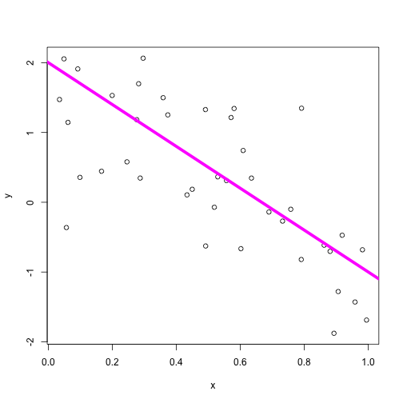
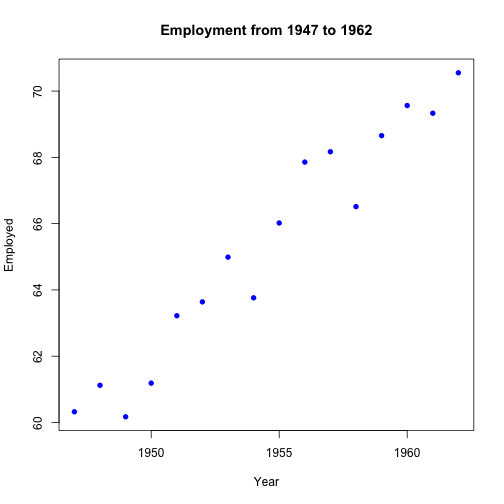
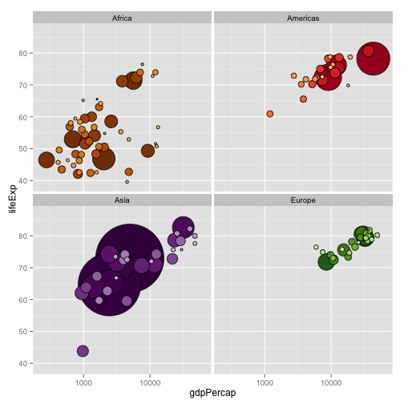

AQM Workshop #2
========================================================
author: Dustin Johnson

Object-oriented programming (OOP)
========================================================

All R statements where you create objects – “assignments” – have this form:


`objectName <- value`


* You provide your **object** with _information_ or "functions" (numbers, characters, giant matrices, etc.) using the operator "`<-`". We call the process "assignment". Why not "`=`"?

* We can use a shortcut! ... just press `"alt" "-"`.

Example
========================================================

x <- 5

y <- sin(5 - pi/2)

z <- seq(from = 1, to = 100, by = 1)

This_is_cool <- "Hello"

Can_I_do_this <- c("I", "guess")

and_this <- no_way

OMG_boring <- matrix(0, nrow = 10, ncol = 10)


R already knows some functions
========================================================


```r
date()
```

```
[1] "Fri Nov 21 19:53:22 2014"
```

* check `ls()` and `objects()`

* Or remove an object: `rm(x)`

* Or everything: `rm(list = ls())`

Having fun
========================================================


```r
cool <- rnorm(100, mean = 20, sd = 5)
plot(cool)
```

 

cool_plot <- plot(cool) ...? why can't we make it an object? Try it!

`rnorm()`
========================================================

`rnorm()` is a built in function.

**ALWAYS LOOK AT THE FUNCTION**


```r
?rnorm
```

It is important to know what it does before you start using it. Sometimes, you need help on a function, so you can consider this the help page, or user manual.


Having fun
========================================================


```r
a <- 2
b <- -3
sig_sq <- 0.5
x <- runif(40)
y <- a + b * x + rnorm(40, sd = sqrt(sig_sq))
(avg_x <- mean(x))
```

```
[1] 0.4504081
```


Always comment your code!
========================================================


```r
# construct constants
a <- 2
b <- -3
sig_sq <- 0.5

# draw 40 uniformly random numbers
x <- runif(40)

# Build a function
y <- a + b * x + rnorm(40, sd = sqrt(sig_sq))

# Average of our uniformly random variable (x)
(avg_x <- mean(x))
```

```
[1] 0.5004868
```


Having fun
========================================================


```r
plot(x, y)
abline(a, b, col = "magenta", lwd = 5)
```

 

Make your own fun object
========================================================

Try to make your own assignment.

1. Specify your object name.
2. Provide it with the info you wish to hold on to (`<-`)
3. Test it out

Working Directory
========================================================

This is where R will load or save your files by default.

Here's mine:

```r
getwd()
```

```
[1] "/Users/KinZ/R Directory/MyPage/html5up-prologue/AQM/Week2"
```

But if you don't like the default, you can change it:

```r
setwd("~/yourProject")
```

Working Directory
========================================================

Sometimes we need packages (functions, data, etc.) that R just doesn't have on hand. We install from CRAN!

We use:

```r
install.packages("package_name")
```
Try loading the package 'swirl'.

Now we must tell R to use it, so call it from our package library:


```r
library("package_name")
```

Swirl is your friend. Use it as a guide through regression and data cleaning to a biostat bootcamp!

RStudio Projects
========================================================
Keeping all the files associated with a project organized together!

When you are loaded in a project, your working directory revolves around it.

Check it yourself!

Vectors vs Lists
========================================================

What is a vector?

What is a list?

Make one of each.


Matrices vs data.frames
========================================================

Matrix:

```r
matrix(c(1,2,3,4), nrow = 2, ncol = 2)
matrix(c(1,2,3,4), nrow = 2, ncol = 2, byrow = TRUE)
```

Data.frame:

```r
n = c(2, 3, 5) 
s = c("aa", "bb", "cc") 
b = c(TRUE, FALSE, TRUE) 
df = data.frame(n, s, b)
```

Difference?


Data
========================================================


```r
# load a the R's data package
library(MASS)

# Assign the data to an object
long.dat <- longley

# Examine the data
class(long.dat)
dim(long.dat)
names(long.dat)
str(long.dat)
head(long.dat)
```

Data cont.
========================================================
If its too long, things go wrong!

```r
library(MASS)
long.dat <- longley
long.dat
```

```
     GNP.deflator     GNP Unemployed Armed.Forces Population Year Employed
1947         83.0 234.289      235.6        159.0    107.608 1947   60.323
1948         88.5 259.426      232.5        145.6    108.632 1948   61.122
1949         88.2 258.054      368.2        161.6    109.773 1949   60.171
1950         89.5 284.599      335.1        165.0    110.929 1950   61.187
1951         96.2 328.975      209.9        309.9    112.075 1951   63.221
1952         98.1 346.999      193.2        359.4    113.270 1952   63.639
1953         99.0 365.385      187.0        354.7    115.094 1953   64.989
1954        100.0 363.112      357.8        335.0    116.219 1954   63.761
1955        101.2 397.469      290.4        304.8    117.388 1955   66.019
1956        104.6 419.180      282.2        285.7    118.734 1956   67.857
1957        108.4 442.769      293.6        279.8    120.445 1957   68.169
1958        110.8 444.546      468.1        263.7    121.950 1958   66.513
1959        112.6 482.704      381.3        255.2    123.366 1959   68.655
1960        114.2 502.601      393.1        251.4    125.368 1960   69.564
1961        115.7 518.173      480.6        257.2    127.852 1961   69.331
1962        116.9 554.894      400.7        282.7    130.081 1962   70.551
```

Subsetting and pulling apart data
========================================================

```r
long.dat[,1]
long.dat[1,]
long.dat[1,1]
long.dat$Employed
long.dat$Employed[,1] # Why doesn't this work?
long.dat$Employed[1]
```


Visualise
========================================================
Show me the interaction of two variables in a plot.

Plot is a function... `?plot`, it will explain.


Let's work through an example
========================================================

```r
plot(long.dat$Year, long.dat$Employed)
```

I'd rather have better names:

```r
plot(long.dat$Year, long.dat$Employed, xlab = "Year", ylab = "Employed", main = "Employment from 1947 to 1962")
```


========================================================
 

What the future holds
========================================================
 
