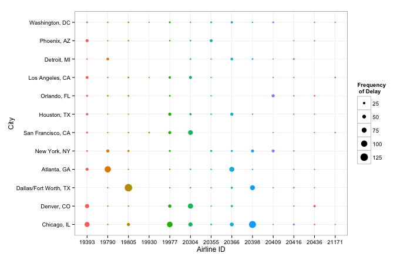

## Question 1
<font color="blue">_List the code of the airline(s) most at fault in the city(ies) with the largest number of departures delayed between 75 to 89 minutes during the month of January 2015._</font>

The following script has been written in R statistical programming. A Python method was also tried, but R obtained a faster computation speed (as indicated later on), hence the use of R. We begin by loading the dependencies:

```{r}
# dependencies
suppressPackageStartupMessages({
	library(knitr) # for nice output
	library(dplyr) # great C++ backend for data wrangling
	library(ggplot2) # pretty plots
})

```

Read the .csv from file and force the AIRLINE_ID variable to be a factor (as we will need later).

```{r}
# read data
on.time <- read.csv("on_time.csv", header = TRUE)

# conform AIRLINE_ID to factor
on.time$AIRLINE_ID <- as.factor(on.time$AIRLINE_ID)
```

```{r, echo=FALSE}
ptm <- proc.time()
```

Let's make sure the data indeed follows from January 2015, otherwise stop. 

```{r}
# make sure year = 2015 and month = Jan = 1
if(!(unique(on.time$YEAR) == 2015 & unique(on.time$MONTH) == 1)) 
	stop("incorrect year and/or month")
```

We proceed with deriving the the cities with the largest number of departures delayed between 75 to 89 minutes. At this point, we must define what constitutes 'large'. Large will be all cities with the number of departures surpassing the 95th percentile, which are determined to be 12 cities. We then semi-join the data frame with the original and summarise the frequency of the airlines most at fault in the 12 cities with the largest number of departures delayed between 75 to 89 minutes during the month of January 2015.
 

```{r}
# departures delayed between 75 to 89 minutes
on.time.filtered <- on.time %>%
	select(MONTH, AIRLINE_ID, ORIGIN_CITY_NAME, DEP_DELAY) %>%
	filter(DEP_DELAY > 75 & DEP_DELAY < 89)

# cities with the largest number of departures
cities.most.delayed <- on.time.filtered %>%
	group_by(ORIGIN_CITY_NAME) %>%
	summarise(TOTAL_DELAYED = length(DEP_DELAY)) %>%
	arrange(desc(TOTAL_DELAYED)) %>%
	filter(TOTAL_DELAYED > 2*sd(TOTAL_DELAYED))

# code of the airlines causing delays at the corresponding
# cities with largest number of departures
airlines.most.delayed <- on.time.filtered %>%
	semi_join(cities.most.delayed, by = 'ORIGIN_CITY_NAME') %>%
	group_by(ORIGIN_CITY_NAME, AIRLINE_ID) %>%
	summarise(FREQ_OF_DELAY = length(DEP_DELAY))
```

The computational time is:

```{r, echo=FALSE}
proc.time() - ptm	
```

**The plot below demonstrates the Airlines most at fault for the delays in the cities exceeding the 95th percentile of delayed departures between 75 to 89 minutes during the month of January 2015. The larger the point, the more frequent the delays.**



Finally, we put the 12 cities in descending order of most overall delays, as well as the airline that causes the most delays - "the most at fault". The PERCENTAGE_DELAYED column indicates the percentage that airline "most at fault" contributes to the total number of delays. The higher the percentage, the more at fault the particular airline is for the particular city during the month of January. You notice that airline 19805 causes over 50% of the total delays between 75 to 89 minutes in Dallas/Fort Worth.

```{r}
# code of the airline most at fault for each city and
# the proportion that airline plays out of total delays
airlines.at.fault <- airlines.most.delayed %>%
	ungroup() %>%
	group_by(ORIGIN_CITY_NAME) %>%
	arrange(desc(FREQ_OF_DELAY)) %>%
	top_n(FREQ_OF_DELAY, n = 1) %>%
	inner_join(cities.most.delayed, by="ORIGIN_CITY_NAME") %>%
	mutate(PERCENTAGE_DELAYED = round(100*FREQ_OF_DELAY/TOTAL_DELAYED, digits=2)) %>%
	select(-TOTAL_DELAYED)
kable(airlines.at.fault, align = 'c')
```


If I had time to conduct some further investigation, It would be interesting to investigate whether the geographical location or day of the week/month/year had a role to play (or possibly both).

## Question 2
<font color="blue">_What is the difference between ON and WHERE?_</font>

The difference of these two SQL clauses arise when dealing with an `OUTER JOIN`, as opposed to an `INNER JOIN`. The result of using an `INNER JOIN` is the same in both cases, but let's consider a `LEFT JOIN` or "`LEFT OUTER JOIN`". 

The `ON` clause, used in conjunction with some `AND` criterion, will dictate which rows to join a particular table with the outer table, then return a table involving all rows of the outer table and `NULL` values in the subordinate table entries that do not match the criterion. The `WHERE` clause, used within an `ON` clause, will essentially filter the rows that did not meet the criterion specified, therefore avoiding the `NULL` entries.

## Question 3 
<font color="blue">_What was the most interesting analytics project you have worked on? What made it interesting and what made it challenging?_</font>

On of the most interesting analytics projects I have worked on was during a consulting engagement with a startup called Left of the Dot. I was required to explore a 200 Terabyte PostgreSQL database of spatio-temporal data using both unupervised and supervised learning approaches. Along with a fellow data scientist, I developed large scale clustering, neural network, and Bayesian machine learning algorithms for the purpose of predicting web site conversion rates and Google keyword bids.

The most fascinating aspect of the project was the question of how to model the many keywords that held no historical information (never been clicked). Should I ignore them, despite the possibility of them being clicked? If not, how should we bid? I decided to spatially map all keywords to specific longitudinal and latitudinal coordinates and use a distance criterion to cluster the unknowns, then I left out the keywords that didn't match. If a keyword led to a conversion, it was updated via a Baysian prior.

What made this project challenging was incorporating computational costs into the objective, so it came down to how to process the large data in an efficient way to ensure we did not overshoot our budget. We were attempting to run 500,000 simultaneous neural networks to relatively high dimensional data, which was not feasible, so we used approximation techniques through variable selection and grouping techniques. We wound up saving the company $40,000 a year with the method we developed. It was very challenging and fulfulling, but many unanswered questions still remain. 


## Question 4 
<font color="blue">_How many statistical models were supported on the last analytics platform you worked on?_</font>

To be blatantly honest, I write my own statistical models with a combination of R, Python and C++, as I enjoy the flexibility and robustness. Relying on a platform has its limitations and sometimes I question their accuracy.

That being said, I have utilised docker to host Apache Mahout on a Hadoop platform during my time consulting for Left of the Dot, as well as on my own cloud server. Mahout has approximately 28 statistical/machine learning algorithms/models ranging from Hidden Markov Classification Models to Reccomender Agents.

## Question 5
<font color="blue">_What does ETL stand for? What ETL tools have you used in your previous projects?_</font>

**ETL = Extract-Transform-Load**

When it comes to the ETL process, I have typically used my own Python/Shell scripts. This consisted of extracting data from multiple databases and some web scraping, then conforming it to some data frame structure with aggregations, sorts and joins, then loading it into a data warehouse using an R/Python script. When it comes to larger data, I have Talend's open studio installed locally and have been learning how to integrate it with my AWS server for a website I'm developing (and picking it up more as a result of this question).

I do not have much experience with structuring an ETL process nor have I had the need to use many of these ETL tools, although I have delved into the AWS Data Pipeline for my AWS cloud server for a current project I am working on, as well as IBM Bluemix's DataWorks beta service for learning purposes.

## Question 6
<font color="blue">_What kind of tools do you require to properly build a data processing platform? What is your favourite and why?_</font>

The following fundamental tools would be required to build a data processing platform (big data gets a bit messier):

1. **Collection tools** - this could range from user input with cell phones and web sites to web scraping for information. 
2. **Database** - with a wide range of data coming in from many angles, a database, or even multiple databases which would be fed to a data wharehouse would be required.
3. **ETL tools** - As mentioned above, we need tools to actually process the data and facilitate the Extraction, transforming and loading of data.
4. **Analytics tool** - With all the data in-place and ready-to-go, an analytical tool will be required to output and interpret the data and provide information that will guide future company policies. This would also entail report development and decision-making algorithms.

My favourite tools corresponding to the list above are presented below:

1. It's difficult to specify a collection tool, as it depends on the goal of the task. Typically, I would utilise some application or enable customer inputs and record them automatically into some database.
2. PostgreSQL Database is my favourite database for the time being, mainly because I can use my own custom language (R or Python) inside the database. I also like the fact that it is open source, has flexible data types and encorporates many intuitive SQL functions not inherent in standard SQL.
3. The ETL tool I prefer is definitely the old-fashioned scripting. Otherwise, Talend is a nice open-source friend, mainly because its free and accessible for my learning objectives.
4. I mentioned earlier that Mahout with Hadoop is a great analytics (and even full data processing platform when considered together). The ability to use MapReduce in conjunction with machine learning algorithms makes this platform attractive to me.
5. **BONUS!** I am an extreme fan of docker to facilitate my data processing needs, as I can host images of all my platforms (from data bases to analytic platforms for big data with Hadoop, Hive and Mahout) already constructed to fit my needs and easily separate my applications from my infrastructure. It gives me full control and utilises little space in a cloud-based server. Better yet, it takes minutes to download these 'virtual' servers.

## Question 7
<font color="blue">_You have a list of IDs (column A) and corresponding CUSTOMER NAMEs (column B) in Excel File 1. In Excel File 2, you have a non-identical list of IDs in Column G and you would like to add the corresponding CUSTOMER NAMEs to column H. How would you go about doing this in Excel?_</font>

I would use the function `VLOOKUP`. Within the first element of Column H in File 2 below the header, I would insert the following function:

```{}
VLOOKUP(G2, [File1.xlsx]Sheet1!$A:$B, 2, FALSE)
```

I would then copy this function down the column. An `NA` will pop-up if a value does not match an ID in File 2. We set **Range_Lookup** to **FALSE**, as we do not want fuzzy string matching in our case with unique identifiers. The result is a list of IDs in Column G in File 2 with the corresponding CUSTOMER NAMEs in column H. To be extra safe, it is best to copy the table without the formulas into another sheet where adjustments to File 2 will impact our our new File 2 down the road. 


## Question 8

a. <font color="blue">_You have a list of POSTAL CODEs in Excel. What is the simplest and quickest function you can use in Excel to count the number of instances of each POSTAL CODE._</font>
<br>
<br>
**Method 1** <br>
The function **Subtotals** using the internal function _count_ will simply count the number of instances of each Postal Code. Of course, they will have to be sorted first using the **Sort** function.
<br>
<br>
**Method 2** <br>
Another approach to count a particular instance would be `COUNTIF(range, criteria)`. If you wanted the count each instance at once, you would want to use Excel's **advanced filter** and click on **unique records only**, then use the unique records to summarise the count of each instance of POSTAL CODE.

b. <font color="blue">_The list of POSTAL CODES in excel was inputed imperfectly. The list includes a mix of upper and lower cases (e.g. A1A 1A1 and A1A 1a1). What function in excel would you use to ensure the counts are correct, e.g. the instances in both A1A 1A1 and A1A 1a1 are aggregated into one count?_</font>
<br>
<br>
Referring back to the **Subtotals** function after using **Sort**, we notice that the groups are already not case sensitive. As a sanity check, I would sum the number of groups using `COUNTIF(POSTAL_CODE_LIST, "*")` and cross-check that value with the number of unique case-sensitive entries using the following array function:
```{}
{=SUM(IFERROR(1/IF($A$1:$A$9<>"", FREQUENCY(IF(EXACT(POSTAL_CODES_LIST, TRANSPOSE(POSTAL_CODES_LIST)), MATCH(ROW(POSTAL_CODES_LIST), ROW(POSTAL_CODES_LIST)), ""), MATCH(ROW(POSTAL_CODES_LIST), ROW(POSTAL_CODES_LIST))), 0), 0))}
```
Ultimately, the number of unique case-sensitive values should exceed the number of groups, with the difference indicating the number of "input mistakes".
<br>
<br>


c. <font color="blue">_The list of POSTAL CODES in excel was inputed imperfectly. Where the number 0 was intended, the letter O was actually inserted, e.g. A1A 1A0 was actually entered as A1A 1AO. What function would you use to correct this issue?_</font>
<br>
<br>
Using Excel's **Find and Replace** function would simply correct this issue for all instances.

## Question 9
<font color="blue">_Describe a Macro you developed in Excel and what it was used for_</font>

I wrote a macro for an equity researcher who wanted to automate the retrieval and processing of stock and financial data from an arbitrary Index through the Yahoo Finance API and output an Excel spreadsheet with ratios, metrics and benchmarks updated each day. I used an R script to automatically extract the required data from the Yahoo API each day, transform it into a formatted csv file, and load it into a specified directory. I developed an Excel macro that pulled the updated csv file from the directory, calculated the coefficients of a regression equation, analysed cross-correlation between the closing prices, normalised the data, identified tail-end metrics that fell outside of a 95% confidence interval, and colour-coded them accordingly. The final result was an updated Excel sheet each day with all the data readily-prepared to make buy/sell/hold decisions.


