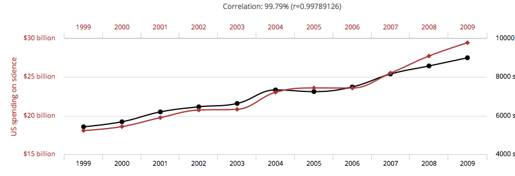

# Data 

Data answers the following three questions: 

- <span style="color:orange; font-weight:bold"> What happened? </span>
- <span style="color:dodgerblue; font-weight:bold"> Where are we going? </span>
- <span style="color:lightgreen; font-weight:bold"> What to do now? </span>

---

# Data Analysis

<span style="color:dodgerblue; font-weight:bold"> Data itself has no meaning. It's what we can extract from it that gives it meaning. This requires analysing the data. </span>

<BR>
<span style="color:orange; font-weight:bold">
That being said, personal bias and deceit can always play a role, which is another reason to learn to understand where the results came from!
</span>
</BR>

---



---


---

# Why Programming?

<span style="color:dodgerblue; font-weight:bold">You are the creator. You are God.</span>

<BR>
- Control operations
- Analyse anything of your choosing
- Automate a time-consuming task
- Create your own product
- Make a programming language...
</BR>

---

##  ... with Arnold quotes!


---

# R Language

<span style="color:orange; font-weight:bold">R is a statistical programming language that is:</span>
- open source ==> freely available
- highly compatible for data analysis with many types of data structures
- simple and quick (relatively) to learn and use
- highly compatible with other languages (it was made from C and Fortran)
- growing in popularity and use (you'll see why)

---

# <span style="color:red; font-weight:bold">Let's set up!</span>

---

# Object-oriented Programming (OOP)

1. Take a number, data set, ANYTHING (I'll chose to say "Hello World")
2. Think of a name to call it (I'll call mine, My.Object)
2. Feed it into an object by it's name using "<-""
4. Now your information is saved into the object given by its name for you to call in the future

<BR>
<span style="color:dodgerblue; font-weight:bold"> Example: </span>
```{r}
My.Object <- "Hello world"
My.Object
```
</BR>

---

# Functions

- R has many build-in functions that perform tasks for you, saving you the work of programming them yourself.

- Examples of functions are:
	- <span style="color:dodgerblue; font-weight:bold">date()</span>
	- <span style="color:dodgerblue; font-weight:bold">data()</span>
	- <span style="color:dodgerblue; font-weight:bold">is.numeric()</span>


- Many functions are available within packages, which R keeps in a its library. We can easily check what we have with the function ```library()```. For special (most) packages, we must download them from a magical place called Cran.

---

# Cran

- Cran is the massive repository online which houses all the fully developed R packages.

<BR>
- Let's say I want to read and analyse stock data through an API (more on API's later). I can search on Google and find that the package "quantmod" does the trick! So, I can install the package, check the library and read it into R from the library anytime I need it (must be done once per session). In these packages are many useful functions!
</BR>

```{r, eval=FALSE}
# I can make comments with hash tags
install.packages("quantmod") # install
library() # check library
library(quantmod) # load the package in this R session
```

---

### What are the functions!? I need help!

- Firstly, Cran has all the tutorials you need online in a pdf format for each function. 
- If thats not enough, Stack Overflow is a great great resource of fellow programmers. If you have a question, I can almost guarantee you'll find it there. 
- More simply, we can do the following (assuming we know the function):

```{r, eval=FALSE}
?getSymbols
?matrix
?date
```


---

# Types of objects

- numeric, integer, string: 
	- <span style="color:dodgerblue; font-weight:bold">x <- 5.09, y <- 2, z <- "cool"</span>
- vectors: 
	- <span style="color:dodgerblue; font-weight:bold">vec <- c(2, 5 , 9)</span>
- matrices: 
	- <span style="color:dodgerblue; font-weight:bold">mat <- matrix(c(1,2,3,7,7,8), nrow = 2)
- data.frames: 
	- <span style="color:dodgerblue; font-weight:bold">df <- data.frame(hello = rep("hello", 4), int = seq(1, 4, by = 1), num = rnorm(4))</span>
- lists:
	- <span style="color:dodgerblue; font-weight:bold">mylist <- list(mat, df, vec)</span>

---

## It's all about data.frames

- R's data.frames can handle data of any type
- When R reads data in, it uses data.frames so that you're data stays in a comfortable format
- numbers stay numeric, factors stay as factors, etc.
- Next, we try reading in data.

---

# First, try Excel

<span style="color:lightgreen; font-weight:bold">Open the Sightings.csv file from the website in Excel. Thoughts? </span>

---

# Reading data

Download the <span style="color:lightgreen; font-weight:bold">Sightings.csv</span> from the website and save it into your working directory. The working directory is where R sees your files.

```{r,echo=FALSE}
data <- read.csv("Data/Sightings.csv")
```

```{r, eval=FALSE}
getwd() # check where R is looking for your files (and if Sightings.csv is there)

data <- read.csv("Sightings.csv") # read in the csv file

head(data) # avoid seeing all the data at once
```

---

# Examining the data

- Data is messy and usually contains way too much information to see with the naked eye. Luckily, R has built in functions that make this more of a human task:

- <span style="color:dodgerblue; font-weight:bold">str(data)</span>
- <span style="color:dodgerblue; font-weight:bold">head(data); tail(data)</span>
- <span style="color:dodgerblue; font-weight:bold">dim(data)</span>
- <span style="color:dodgerblue; font-weight:bold">is.data.frame()</span>


<BR>
<span style="color:lightgreen; font-weight:bold">
What do these functions tell you abou the data? So long, Excel!
</span>
</BR>

---

# Disseminating the Data

- We can pull what we need from the data using simple operators:

```{r, eval=FALSE}
sightings <- data$sightings # gives us the column (vector) called sightings

sightings2 <- data[,2] # same as above, but specifying column number [row, column]

obs <- data[dim(data)[1], 1] # what does this do?

obs2 <- max(data$sightings) # or max(sightings) as we alread made the sightings object
```

<span style="color:orange; font-weight:bold"> Functions within functions are possible! Remember "?function_name" to learn about the funtion.</span>

---

# Logical Operators

- <span style="color:dodgerblue; font-weight:bold"> Logical operators consist of ">", "<", "==", ">=", "<=", "!". Look familiar? </span>

```{r, eval=FALSE}
which(data$sightings > 500) # what does this tell you? try ?which

which(data$sightings == max(data$sightings)) 

which(data$id == dim(data)[1])

newdata <- data[which(data$sightings > 100),]
```

---

# Challenge #1

- <span style="color:dodgerblue; font-weight:bold"> What is the year of the first sighting? </span>
- <span style="color:orange; font-weight:bold"> Which year had the most sightings?</span>
- <span style="color:lightgreen; font-weight:bold"> which month(s) had less than 5?</span>

---

# Excel Challenge

- <span style="color:lightgreen; font-weight:bold"> Construct a data table that summarises the average number of sightings for each year and remove all those that contain 1 </span>
- plot it if you feel the desire


---

### dplyr - the mother of data analysis packages

- **dplyr** is build off of a base R package that provides convenient and powerful tools for wranging data into the format you desire. 
- It uses natural "verbs" and piping operators to keep things fast and efficient. What does that mean?
```{r, eval=FALSE}
install.packages("dplyr")
```
```{r, message=FALSE}
library(plyr) # base package must be loaded first
library(dplyr)
```

---

- <span style="color:dodgerblue; font-weight:bold"> select()</span> - select the variables (columns) of the data you are interested in.
- <span style="color:dodgerblue; font-weight:bold"> filter() </span>- filter the rows of the data.frame utilising your logical operators >,<,>=,<=, and == according to the data of interest.
- <span style="color:dodgerblue; font-weight:bold"> group_by()</span> - group the data according to some category, for instance, group all data by continent.
- <span style="color:dodgerblue; font-weight:bold"> summarise()</span> - Summarise multiple values to a single value. For example, the mean GDP or total GDP of each continent, where the continent group was created using the function group_by().
- <span style="color:dodgerblue; font-weight:bold"> mutate()</span> - mutate or transform one variable into another using some function. For example, create a new variable (column) that is a combination of two other variables (population and GDP).

---

# Let's give them a try

- The dplyr piping operator is <span style="color:lightgreen; font-weight:bold">%>%</span>, which you can think of as "and then". Let me show you:

- select the year and sightings columns "and then" group the data according to the year "and then" summarise each year by the mean sightings.

```{r, eval=FALSE}
data.new <- data %>%   # specify data you are using "and then"
	select(year, sightings) %>% # select the year and sigtings columns
	group_by(year) %>% # group data according to year
	summarise(mean.sightings = mean(sightings)) # select the date and sightings columns
```

- Let's remove those years where one is sighted

```{r, eval=FALSE}
data.update <- data.new %>%
	filter(mean.sightings != 1)
```

- <span style="color:orange; font-weight:bold">How about by month?</span>

---

## Visualisation

<span style="color:dodgerblue; font-weight:bold">R has base plots:</span>
```{r, eval=FALSE}
plot(mean.sightings ~ year, data.update)
```


---

# Quick Challenge

- <span style="color:lightgreen; font-weight:bold">What is the year in which sightings erupt?</span>
- <span style="color:dodgerblue; font-weight:bold">Is there a month where sightings are more prominent? </span>

---

## This is awkward... the plot is ugly... 

---

# <span style="color:red; font-weight:bold">ggplot2 :)</span>

```{r, eval=FALSE}
install.packages("ggplot2")
```

---

# ggplot2

- R's plots don't follow the object orientation! I can't save them for later.
- ggplot uses data.frames and makes visually appealing plots
- works well with dplyr, and has the same intuition (thank you Hadley!)

---

# How ggplot2 works

### <span style="color:dodgerblue; font-weight:bold">myPlot <- ggplot(data.frame, aes(x, y, ...)) + ? </span>

- I call my plot **myPlot** (now it's an object :) )
- I place my data.frame in
- I specify the aesthetics (parameters specifying the plot)
- Then, I must specify what my plot will be (scatter, line, histogram, etc.)

---

# Example

```{r, eval=FALSE}
library(ggplot2)
myPlot <- ggplot(data.update, aes(x = year, y = mean.sightings)) + geom_line(colour = "blue")
```

- <span style="color:lightgreen; font-weight:bold"> But I want to add more! Then let's just add properties to the object!</span>

```{r, eval=FALSE}
myPlot2 <- myPlot + 
	geom_point(colour = "red") + theme_bw() + 
	ggtitle("Sightings by Year") +
	geom_vline(xintercept = 1994, linetype = "dashed")
```

---


--- 

## Can you do better?

- <span style="color:dodgerblue; font-weight:bold">check the resources for ggplot2 to learn the types of plots and its capabilities.</span>
- <span style="color:orange; font-weight:bold">there are many other types of visualisations you can handle with ggplot</span>

---

# A more flavourful data set - Gapminder

- Download the .tsv into your working directory
- Read in gapminder

```{r, eval=FALSE}
gapminder <- read.delim("Workshops/Data_Analysis_Intro/Data/gapminder.tsv")
```

- why read.delim? What is a .tsv vs .csv?
- Examine the data using the functions you used previously

---

# Example

```{r, eval=FALSE}
# dplyr wrangling
gDat <- gapminder %>%
    select(continent, year, pop) %>%
    filter(year == 2007) %>%
    filter(continent != "Oceania") %>% # what am I doing here? Why?
    group_by(pop) # Why group by population?

# ggplot plotting
p1 <- ggplot(gDat, aes(log(pop), fill = continent)) + 
    geom_density(alpha = 0.5) + # what does alpha do?
    facet_wrap(~continent) + 
    ggtitle("Distribution of Population by Continent in 2007") +
		theme_bw()
print(p1)
```

---


---

# Your turn!

- get into groups and take 20 minutes to find something interesting in the gapminder data.
- use dplyr to investigate and wrangle the data, then use a visualisation technique with ggplot
- remember to check the cheetsheets and resources on the workshop site

---

# Let's get BIGGER!

Grab these data sets and do the same routine.

1. [Aquistions.csv](https://github.com/Dustin21/Dustin21.github.io/raw/master/Workshops/Data_Analysis_Intro/Data/CrunchBase/Aquisitions.csv)
2. [Companies.csv](https://github.com/Dustin21/Dustin21.github.io/raw/master/Workshops/Data_Analysis_Intro/Data/CrunchBase/Companies.csv)
3. [Investment.csv](https://github.com/Dustin21/Dustin21.github.io/raw/master/Workshops/Data_Analysis_Intro/Data/CrunchBase/Investment.csv)
4. [Rounds.csv](https://github.com/Dustin21/Dustin21.github.io/raw/master/Workshops/Data_Analysis_Intro/Data/CrunchBase/Rounds.csv)

---

### What is this Data?

- Dataset of record for the startup and venture capital communities. It can provide information on anything from what industries are hot (biotech) to the potential effects of founder experience or age. 
- The dataset includes funding, investment, and acquisition data on over 40,000 companies.
- What kinds of questions can you ask? 
	- Are there characteristics of a company—industry, location, etc. that differ by VC? 
	- Do some VCs typically invest together, while others rarely do so? 
	- Are companies raising more money earlier? 
	- ARE WE IN A BUBBLE??
		
source: http://blog.modeanalytics.com/five-public-dataset/

--- 

# Task

- This data is not pre-cleaned ==> <span style="color:red; font-weight:bold">NA</span> values!
- These data sets can be combined with dplyr join functions!
	- <span style="color:dodgerblue; font-weight:bold">inner_join</span>
	- <span style="color:dodgerblue; font-weight:bold">left_join()</span>
	- <span style="color:dodgerblue; font-weight:bold">semi_join()</span>
	- <span style="color:dodgerblue; font-weight:bold">anti_join()</span>
	- <span style="color:dodgerblue; font-weight:bold">merge()</span> (technically plyr)
- group up and find something unique. What you find may be unknown as of now in the VC industry!

